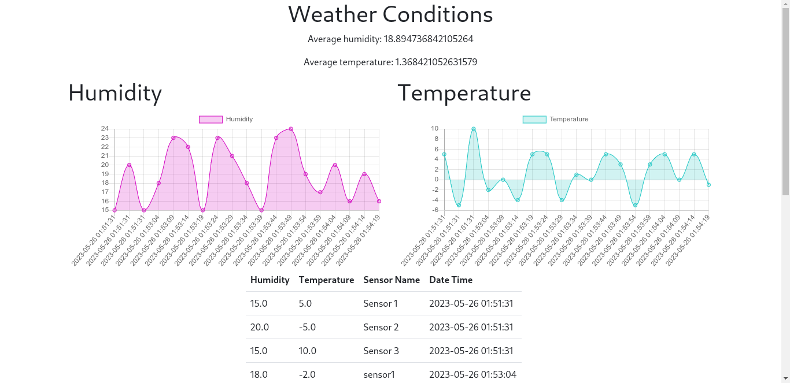

# How To:
You will first need to build each image and create a network to connect each image

### Build Image

- mysql database `docker build -t mysql AnalysisNode/mysql`

- webapp `docker build -t webapp AnalysisNode/app`

- sensor `docker build -t sensor DataSourceNode/app`

### Create Network
- `docker network create analysis_net`

### Run and Connect Network

- mysql image: 
    `docker run -dp 3306:3306 --network analysis_net --network-alias mysql -v mysql-data:/var/lib/mysqld mysql`
- webapp image:
    `docker run -itp 5000:5000 --network analysis_net --network-alias webapp webapp`
- sensor:
    `docker run -itp 5001:5001 --network analysis_net -e SENSOR='Sensor Name' sensor`

*Note:
    to achieve this architecture you will need to duplicate the DataSourceNode sensor image on a different vm and give its own environment name which the app will use as the name of the sensor.

